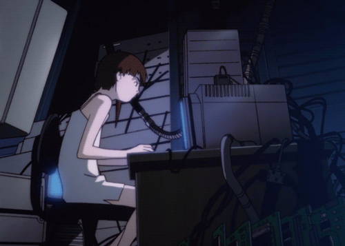

<h1>nice to meet you, i'm juiyya!</h1>

<h3 align="center">about me </h3>

- studying Computer Science at FIAP  
- passionate about hardware and how things work under the hood  
- when I'm not coding, I'm probably making music  

<h3>languages and tools</h3>

  
  
  
  
  
  
  
  
  

<h3>my stats</h3>

  
  

 
<picture>
  <source media="(prefers-color-scheme: dark)" srcset="https://raw.githubusercontent.com/juiyya/juiyya/output/github-snake-dark.svg"/>
  <source media="(prefers-color-scheme: light)" srcset="https://raw.githubusercontent.com/juiyya/juiyya/output/github-snake.svg"/>
  
</picture>

<h3>contact me</h3>

